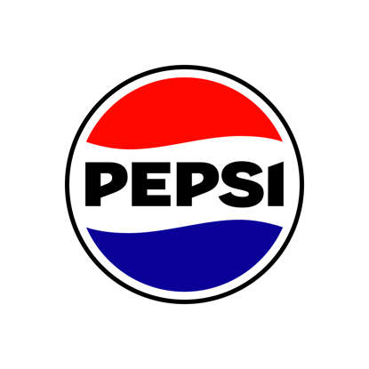

# TEAM

1. Imiona = Sean Mc Kinney, Wiktor Pelczar, Wojciech Miernik
1. Konta Github = Seaniok, Miernik7373, WiktorPelczar
1. Numery zadań = Sean Mc Kinney 1 i 6, Wiktor Pelczar 4 i 5, Wojciech Miernik 2 i 3

# WPROWADZENIE

## Co to żywność/jedzenie ?

Żywność, środek spożywczy – produkt przetworzony, częściowo przetworzony lub nieprzetworzony, przeznaczony lub nadający się do spożycia przez ludzi, w tym napoje, guma do żucia oraz wszelkie substancje dodawane do żywności w sposób zamierzony podczas wytwarzania, przygotowania lub obróbki.W prawie Unii Europejskiej definicja żywności została podana w artykule 2 Rozporządzenia Parlamentu Europejskiego i Rady z dnia 28 stycznia 2002 r.:

>Żywność (środek spożywczy) oznacza jakiekolwiek substancje lub produkty, przetworzone, częściowo przetworzone lub nieprzetworzone, przeznaczone do spożycia przez ludzi, lub których spożycia przez ludzi można się spodziewać. Środek spożywczy obejmuje napoje, gumę do żucia i wszelkie substancje, łącznie z wodą, świadomie dodane do żywności podczas jej wytwarzania, przygotowania lub obróbki.

## Co to napoje ?

Płyn przeznaczony do konsumpcji przez człowieka. Napoje oprócz swojej podstawowej funkcji, jaką jest zaspokojenie pragnienia oraz dostarczanie pijącemu wartości odżywczych, mogą pełnić między innymi funkcje lecznicze, obyczajowe i obrzędowe (np. podczas zaślubin czy liturgii).

_Kluczowe cechy napoji_
* Podstawowa funkcja: Zaspokajanie pragnienia.
* Wartości odżywcze: Niektóre napoje dostarczają organizmowi cennych składników odżywczych
* Dodatkowe funkcje: Mogą mieć znaczenie ceremonialne, obyczajowe, a nawet lecznicze.
* Sklad: W składzie napoju często znajdują się woda, cukier, aromaty i barwniki. Jednak w odróżnieniu od soków, napoje mogą zawierać dodatkowe substancje, takie jak konserwanty.

## Znane dania 

Najpopularniejszym daniem na świecie jest pizza, a inne powszechnie lubiane potrawy to makarony, takie jak spaghetti, i dania typu street food, w tym tacos, kebab i pad thai. W rankingu najlepszych kuchni świata, na czołowych miejscach znajdują się kuchnia grecka, włoska i hiszpańska, ale popularne są także dania kuchni meksykańskiej, wietnamskiej czy tajskiej. 

Najpopularniejsze dania na świecie:
* Pizza: Pochodzi z Neapolu i jest uznawana za jedno z najbardziej rozpoznawalnych dań na świecie. 
* Makaron: Włosi mają setki rodzajów makaronów, takich jak spaghetti, fettuccine i lasagne, serwowanych z różnorodnymi sosami jak bolognese czy carbonara. 
* Tacos: Meksykańskie danie składające się z tortilli wypełnionej mięsem wołowym, cebulą i pomidorami, doprawione przyprawami. 

# DANE

Ta tabelka przedstawia jedzenie i napoje, restauracja oraz czy jest zdrowe ?

|Jedzenie|Napój|Restauracje|Czy zdrowe?|
|--------|-----|-----------|-----------|
|Pizza|Wino|Pizza Hut|Nie|
|Kotlet schabowy|Kompot|Bar mleczny|Tak|
|Burger|Pepsi|Mc Donald's|Nie|

# OBRAZY

* Pizza

* Burger

* Pepsi

